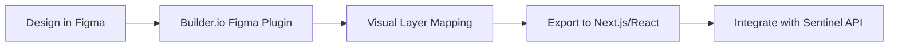

# 🎨 SENTINEL v2.0 - Future UI/UX Prototype

**Version**: 2.0 (Prototype)
**Design Philosophy**: High-fidelity, Data-Dense, AI-Centric
**Workflow Inspiration**: Builder.io (Design-to-Code)

---

## 🚀 THE VISION

SENTINEL v1.0 membuktikan core RAG working. SENTINEL v2.0 akan menjadi platform **Enterprise Intelligence** yang menghandle ribuan transaksi dengan visualisasi yang "wow".

### 1. Hero Experience (Next-Gen Dashboard)

- **Glassmorphism Overlay**: Interface yang terasa ringan namun kaya data.
- **Dynamic 3D Charts**: Menggantikan chart statis dengan visualisasi interaktif.
- **AI Insight Stream**: Feed real-time hasil analisa LLM Llama 3.1.

### 2. Batch Analysis (Efficiency)

- **Drag-and-Drop Dropzone**: Upload ribuan transaksi sekaligus.
- **Progress Tracking**: Ring-progress yang menunjukkan tahapan AI (Retrieval, Scoring, Validation).
- **Flagged Queue**: Prioritas audit otomatis untuk tim compliance.

### 3. Advanced Analytics (Quant Grade)

- **Network Graph**: Visualisasi hubungan antara investor, perusahaan, dan berita (News graph).
- **Temporal Heatmap**: Melihat pola aktivitas mencurigakan sepanjang waktu (Market Opening/Closing).
- **Regulatory Radar**: Score compliance per-artikel POJK secara visual.

---

## 🛠️ BUILDER.IO INTEGRATION WORKFLOW

Untuk mempercepat development UI v2.0, kita akan menggunakan pendekatan **Builder.io Visual CMS**:

### Prototyping Checklist

- [ ] **Visual CMS Deployment**: Menggunakan Builder.io untuk menghandle "Promotional" area di dashboard (Release notes, Documentation).
- [ ] **Drag-and-Drop Page Building**: Investigator bisa memodifikasi layout dashboard mereka sendiri tanpa coding.
- [ ] **Atomic Design System**: Memastikan setiap component di Builder.io sinkron dengan `shadcn/ui` kita.

---

## 📐 COMPONENT SPECIFICATIONS (V2)

### A. The "Risk Pulse" Sidebar

Component yang menunjukkan status risk pasar secara keseluruhan di Indonesia (IDX).

- **Refresh Rate**: 5 seconds.
- **Visual**: Glowing pulse effect (Green/Yellow/Red).

### B. "Agentic Audit" Chat Interface

Floating action button yang membuka chat interface dengan LLM khusus untuk menanyakan detail audit.

- **Tech Stack**: LangChain Core + React Streaming.
- **UI**: Sleek bottom-right panel dengan citasi dokumen OJK langsung di chat.

### C. "Quant Radar" Widget

Radar chart yang menunjukkan 5 axis resiko:

1. **Volumetrics** (Anomaly spikes).
2. **Behavioral** (Typical patterns).
3. **Regulatory** (POJK alignment).
4. **News Sentiment** (Insider link to events).
5. **Connectivity** (Relation to other flagged accounts).

---

## 🔗 NEXT STEPS (ROADMAP)

### Phase 5: UI Evolution (Week 5-6)

- **Migrasi ke Builder.io SDK**: Untuk dynamic UI generation.
- **D3.js Deep Integration**: Untuk visualisasi jaringan investor kompleks.
- **Theme Engine**: Professional Light/Dark mode dengan "Capital Market" color palette.

---

*SENTINEL v2.0 is not just an app; it's a surveillance weapon.*
